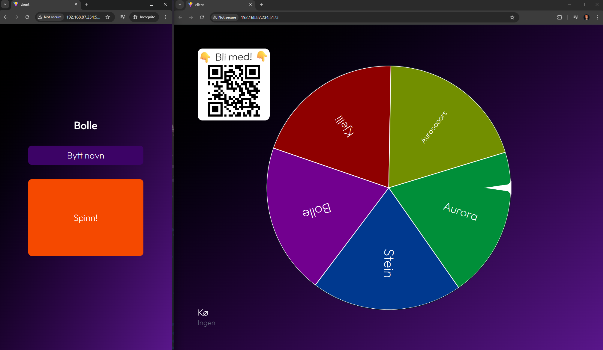

# Spacetime Wheel

Multiplayer spin-the-wheel with mobile view (controller) and desktop view (presenter). Spin the wheel and win a blender. Vibecoded in a hurry to learn [spacetimedb](https://spacetimedb.com/home).



## Prerequisites

- npm
- spacetimedb ([other installers](https://spacetimedb.com/install))

  ```pwsh
  # Windows installation for spacetimedb
  iwr https://windows.spacetimedb.com -useb | iex
  ```

## Setup

- npm install

- start spacetime

  ```pwsh
  spacetime start
  ```

- publish module

  ```pwsh
  spacetime publish --project-path server
  ```

## Run it

- start spacetime

  ```pwsh
  spacetime start
  ```

- run project

  ```pwsh
  npm run dev
  ```
